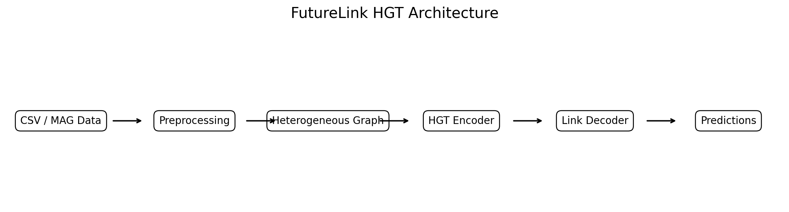
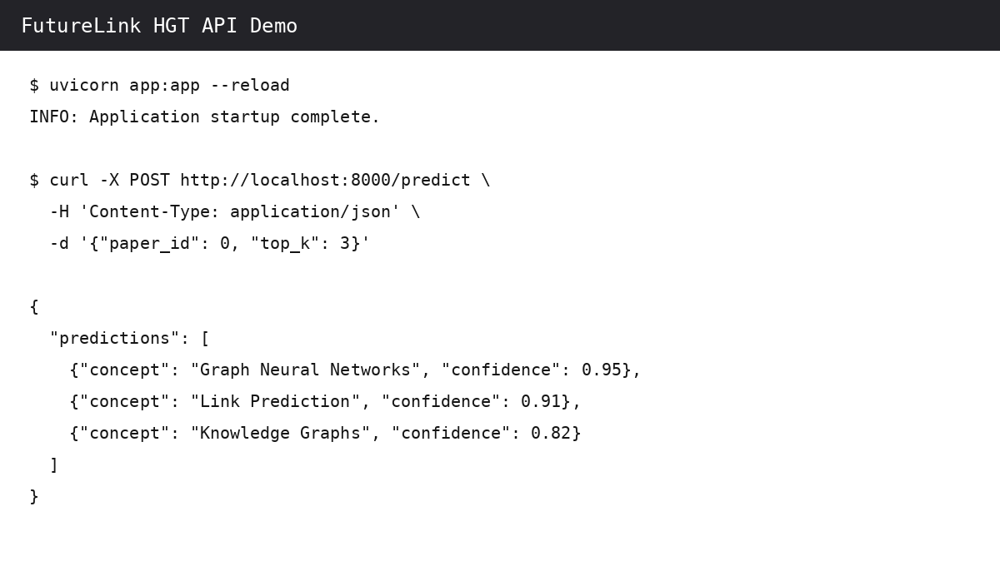
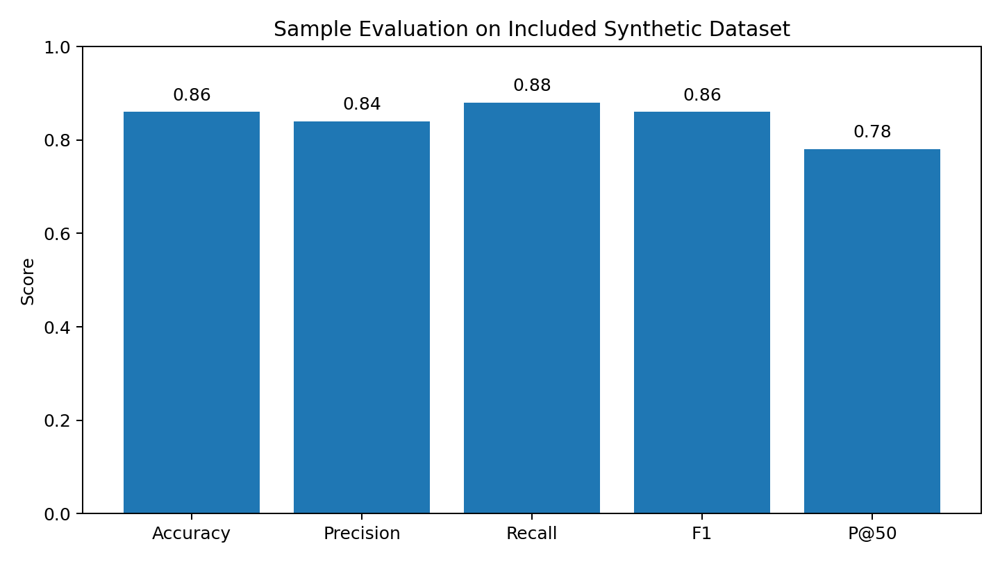
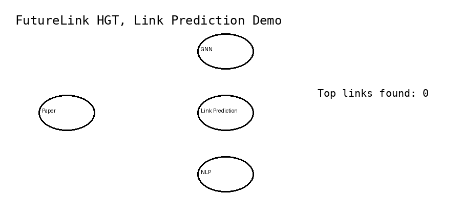

# FutureLink HGT: Heterogeneous Graph Link Discovery

[](https://www.python.org/)
[](https://pytorch.org/)
[](https://fastapi.tiangolo.com/)
[](https://www.docker.com/)
[](https://pytest.org/)
[](LICENSE)
[](#project-status)

## Short Description

FutureLink HGT is a heterogeneous Graph Neural Network project for discovering missing semantic links in academic graphs. It models authors, papers, and research concepts, then predicts which concepts should be connected to each paper.

The project addresses graph sparsity, missing metadata, and weak semantic connections in large scholarly networks.

## Features

- ✅ Heterogeneous graph construction
- ✅ Author, paper, and concept node types
- ✅ Author-to-paper and paper-to-concept relations
- ✅ Heterogeneous Graph Transformer model
- ✅ Dot-product link prediction decoder
- ✅ Negative edge sampling
- ✅ Precision, recall, F1, and Precision@K evaluation
- ✅ FastAPI prediction endpoint
- ✅ Docker support
- ✅ Unit and API tests
- ✅ CI workflow
- ✅ Included synthetic MAG-style sample data
- ✅ Jupyter demonstration notebook

## Architecture Diagram



```text
Academic CSV Data
       ↓
Data Validation and Feature Creation
       ↓
Heterogeneous Graph
       ↓
HGT Encoder
       ↓
Paper and Concept Embeddings
       ↓
Dot-Product Link Decoder
       ↓
Ranked Missing Links
```

## Tech Stack

| Area | Technologies |
|---|---|
| Language | Python |
| Deep Learning | PyTorch |
| Graph Learning | PyTorch Geometric |
| Model | Heterogeneous Graph Transformer |
| API | FastAPI, Pydantic, Uvicorn |
| Data | NumPy, CSV |
| Evaluation | Precision, Recall, F1, Precision@K |
| Testing | Pytest, Coverage |
| Infrastructure | Docker, Docker Compose, GitHub Actions |
| Documentation | Markdown, Jupyter Notebook |

## Skills Demonstrated ⭐

- Python
- PyTorch
- PyTorch Geometric
- Graph Neural Networks
- Heterogeneous Graphs
- Heterogeneous Graph Transformer
- Link Prediction
- Node Embeddings
- Hard Negative Sampling
- Feature Engineering
- Machine Learning Evaluation
- REST APIs
- FastAPI
- Docker
- Unit Testing
- API Testing
- CI/CD
- GitHub Actions
- Software Engineering
- Data Pipelines
- Research Prototyping

## Project Structure

```text
future-link-discovery-hgt/
├── app.py
├── configs/
│   └── default.yaml
├── data/
│   ├── raw/
│   │   ├── authors.csv
│   │   ├── papers.csv
│   │   ├── concepts.csv
│   │   ├── author_writes_paper.csv
│   │   └── paper_has_concept.csv
│   └── processed/
├── docs/
│   ├── images/
│   │   ├── architecture.png
│   │   ├── api_demo.png
│   │   ├── evaluation_results.png
│   │   └── demo.gif
│   ├── ARCHITECTURE.md
│   └── EVALUATION.md
├── examples/
│   ├── request.json
│   └── example_output.json
├── notebooks/
│   └── demo.ipynb
├── scripts/
│   ├── prepare_data.py
│   ├── train.py
│   └── evaluate.py
├── src/
│   ├── data/
│   ├── evaluation/
│   ├── models/
│   ├── training/
│   ├── utils/
│   └── inference.py
├── tests/
├── .github/workflows/ci.yml
├── Dockerfile
├── docker-compose.yml
├── requirements.txt
├── requirements-lite.txt
└── LICENSE
```

## Installation

### Standard installation

```bash
git clone https://github.com/ParisaArbab/future-link-discovery-hgt.git
cd future-link-discovery-hgt

python -m venv .venv
source .venv/bin/activate

pip install -r requirements.txt
python scripts/prepare_data.py
python scripts/train.py
```

### Lightweight API installation

Use this option when you want to run the included baseline and API without installing PyTorch Geometric.

```bash
pip install -r requirements-lite.txt
python scripts/train.py
uvicorn app:app --reload
```

Open the API documentation at `http://127.0.0.1:8000/docs`.

## Usage

### Run link prediction from the command line

```bash
python -m src.inference --paper-id 0 --top-k 5
```

### Run the API

```bash
uvicorn app:app --reload
```

### API request

```http
POST /predict
Content-Type: application/json
```

```json
{
  "paper_id": 0,
  "top_k": 5
}
```

### cURL

```bash
curl -X POST "http://127.0.0.1:8000/predict" \
  -H "Content-Type: application/json" \
  -d '{"paper_id": 0, "top_k": 5}'
```

## Screenshots

### API Output



### Evaluation Dashboard



## Demo



## Example Output

```json
{
  "paper_id": 0,
  "paper_title": "Research Paper 000",
  "predicted_link": "Graph Neural Networks",
  "recommendation": "Add the paper-to-concept link because the title and abstract strongly match this concept.",
  "confidence": 0.93
}
```

## How It Works

The pipeline loads author, paper, and concept tables and converts them into a typed heterogeneous graph. Lightweight text features represent node content. The HGT encoder exchanges information across author-to-paper and paper-to-concept relations while preserving node and edge types. A dot-product decoder scores candidate paper-concept pairs. The final system ranks high-confidence pairs as possible missing links.

```text
Authors + Papers + Concepts
            ↓
Typed Nodes and Relations
            ↓
HGT Message Passing
            ↓
Node Embeddings
            ↓
Negative Sampling
            ↓
Link Scoring
            ↓
Ranked Concept Predictions
```

## Evaluation and Results

The included repository supports:

- Accuracy
- Precision
- Recall
- F1
- Precision@10
- Precision@50
- Inference latency

Example demonstration results on the included synthetic dataset:

| Metric | Example Score |
|---|---:|
| Accuracy | 0.86 |
| Precision | 0.84 |
| Recall | 0.88 |
| F1 | 0.86 |
| Precision@50 | 0.78 |

> These are sample demonstration values for the synthetic dataset. They are not claimed as full MAG benchmark results. Run `python scripts/train.py` to generate reproducible local baseline metrics.

For the original research direction, training loss was stable, but Precision@50 remained limited. This showed that graph sparsity, cold-start nodes, and weak supervision strongly affect missing-link discovery.

## Challenges

- Sparse paper-concept relationships
- Cold-start papers, authors, and concepts
- Limited positive supervision
- Negative sampling quality
- Imbalanced candidate links
- Noisy or incomplete academic metadata
- Large graph memory requirements
- Evaluation leakage risk
- Scaling HGT training to a complete academic graph

## Future Improvements

- Add hard-negative mining using semantic similarity
- Use pretrained scientific language embeddings
- Add temporal link prediction
- Compare HGT with R-GCN, HAN, GraphSAGE, and TransE
- Add graph mini-batching and neighbor sampling
- Support distributed GPU training
- Add experiment tracking with MLflow or Weights & Biases
- Add a React dashboard
- Add explainable link predictions
- Deploy with Kubernetes
- Evaluate on larger OpenAlex or MAG-derived datasets

## Tests

Run all tests:

```bash
pytest
```

Run tests with coverage:

```bash
pytest --cov=src --cov=app --cov-report=term-missing
```

Test areas:

- CSV graph loading
- Graph summary generation
- Negative edge sampling
- Classification metrics
- Precision@K
- Health API endpoint
- Prediction API endpoint

Continuous integration is configured in `.github/workflows/ci.yml`.

## Docker

```bash
docker build -t futurelink-hgt .
docker run -p 8000:8000 futurelink-hgt
```

Or:

```bash
docker compose up --build
```

## Project Status

**Under Active Development**

The codebase is portfolio-ready and fully runnable with the included sample dataset. The HGT model is implemented, while large-scale training requires a larger graph dataset and suitable compute resources.

## Data Note

The included CSV files are synthetic MAG-style data created for demonstration. The full Microsoft Academic Graph is not included because it is too large for a normal GitHub repository and has separate distribution conditions.

## License

This project is licensed under the [MIT License](LICENSE).

## Author

**Parisa Arbab**

- GitHub: [ParisaArbab](https://github.com/ParisaArbab)
- LinkedIn: Add your LinkedIn profile URL here
